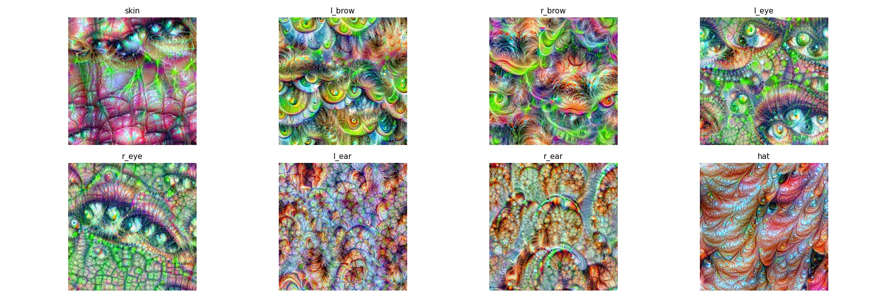
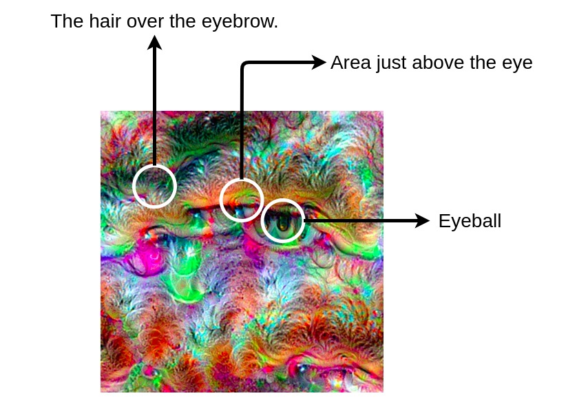
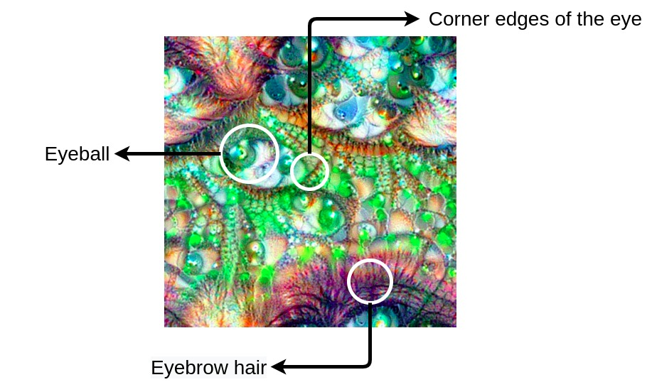
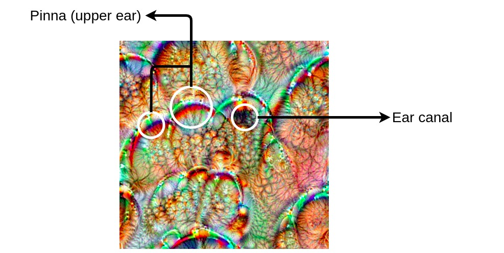

## What does a model look for when segmenting a face ?

:exclamation: This project was made on an older version of [torch-dreams](https://github.com/Mayukhdeb/torch-dreams), so it might not work:exclamation:
## Breaking it down

### Eyebrows

When the model looks for an eyebrow, it actually looks for three things:

1. The hair over the eyebrow (obvious)  
2. The area just above the eye (not so obvious) 
3. The eyeball (not so obvious)

### Eyebrows

When the model looks for an eyebrow, it actually looks for three things:

1. The hair over the eyebrow (obvious)  
2. The area just above the eye (not so obvious) 
3. The eyeball (not so obvious)

### Eyes
For the eye, the model looks for: 

1. Eyeball (obvious)
2. Corners of the eye (obvious)
3. Eyebrow hair (not so obvious)

### Ears 

For the ear, the model looks for: 

1. The upper ear (obvious)
2. Ear canal's dark shadow (not so obvious)

